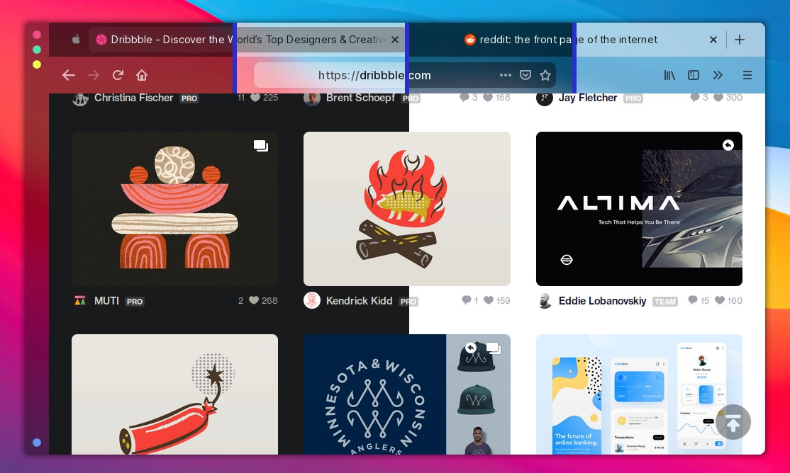
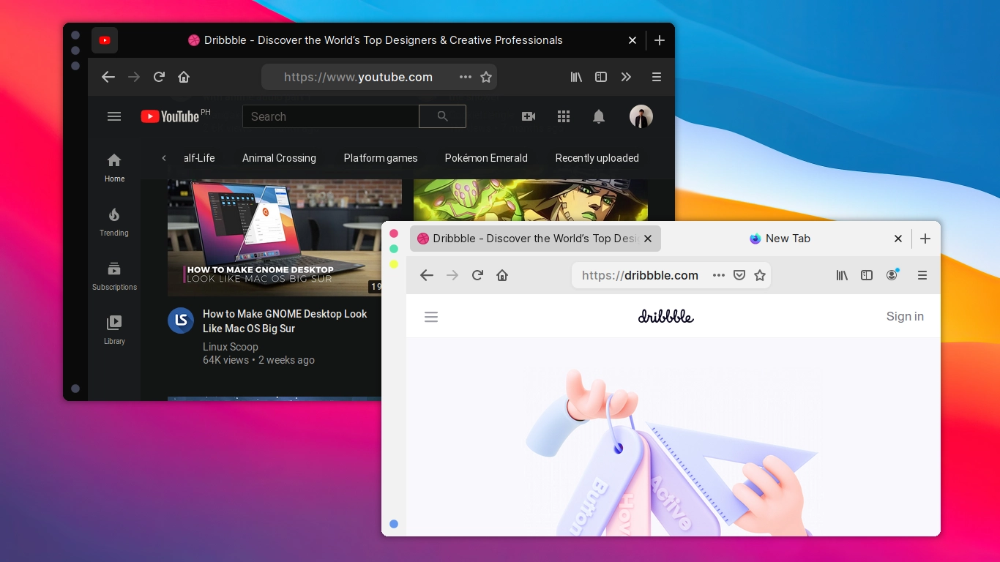

## blurredfox

### A modern Firefox CSS Theme

<p align="center"><br/><i>Firefox with blurredfox CSS theme</i></p>
<p align="center"><br/><i>blurredfox's layout with solid colors</i></p>

## Requirements

+ The latest Firefox
+ Compositor with blur support (optional)

## Notes

+ 100% working on linux.
+ Untested on macOS.
+ Transparency is broken on Windows 10 (has graphical glitches like flickering). The [solid color scheme](https://github.com/manilarome/blurredfox/blob/master/colors/solid.css) *may* work.
+ No, the vertical titlebar is not included. Switch to Linux, then use AwesomeWM to achieve this gloriousness.

## How to

### Quick install for the linux lads

#### Notes before running the script:

+ If you have a multiple firefox builds, the script will still run without a problem. Just make sure to pass your target firefox build.
+ If you or your firefox build have a multiple profile, the script will return an error! Make sure you only have one!
+ It is advisible to check the script first before running it.
+ You need `bash` to run it.
+ If you have an existing chrome folder, the script will make a backup of it in your profile directory.
+ The script will move a file named `user.js` that contains all the preferences needed for blurredfox to work. The existing one will be backed up.
+ If the installation script is not working, feel free to submit an issue or a pull request.

1. Run the script below. If you are using a different build like nightly, beta, etc., make sure to replace the 'stable' with the Firefox Build you are using. If leave empty, it will default to stable.

	```
	# Available parameters:
	# stable - Firefox Stable Build
	# dev - Firefox Developer Edition
	# beta - Firefox Beta
	# nightly - Firefox Nightly
	# esr - Firefox Extended Support Release

	# Examples:

	# Stable build's profile
  	$ curl -fsSL https://raw.githubusercontent.com/manilarome/blurredfox/script/install.sh |
  	bash -s -- stable

  	# Nightly build's profile
  	$ curl -fsSL https://raw.githubusercontent.com/manilarome/blurredfox/script/install.sh |
  	bash -s -- nightly
  	```

2. After the confirmation message that the theme is successfully installed, open firefox. Change the colorscheme by **`Open Menu > Customize > Change colorscheme`**.

### Manual Installation

1. Open `about:config` page.
2. A dialog will warn you, but ignore it, ~~just do it~~ press the `I accept the risk!` button.
3. Search for these:

	+ **`toolkit.legacyUserProfileCustomizations.stylesheets`**
	+ **`layers.acceleration.force-enabled`**
	+ **`gfx.webrender.all`**
	+ **`gfx.webrender.enabled`**
	+ **`layout.css.backdrop-filter.enabled`**
	+ **`svg.context-properties.content.enabled`**

	Then make sure to **enable them all!**. Or you can just copy the `user.js` file to your profile.

4. Go to your Firefox profile.

	+ Linux - `$HOME/.mozilla/firefox/XXXXXXX.default-XXXXXX/`.
	+ Windows 10 - `C:\Users\<USERNAME>\AppData\Roaming\Mozilla\Firefox\Profiles\XXXXXXX.default-XXXXXX`.
	+ macOS - `Users/<USERNAME>/Library/Application Support/Firefox/Profiles/XXXXXXX.default-XXXXXXX`.

5. Create a folder and name it **`chrome`**, then assuming that you already have cloned this repo, just copy the theme to `chrome` folder.
6. Restart Firefox.
7. Finally, you can now change whatever color mode you want in the Cusomization Window.

	+ Default - Uses system colors, but uses the theme's layout.
	+ Dark - Dark colorscheme. Good for the night.
	+ Light - Bright colorscheme. Good for killing the eyes.

## User Support

### Some UIs are broken!

1. Check if you're using the latest version of Firefox.
2. It's broken because you're using Windows 10 and macOS or you're using an ancient version of Firefox.

### If you're using Windows or macOS and something's wrong

1. I only have Archlinux, macOS' untested while the theme is broken on Windows 10.
2. If the transparency is broken, use the [solid color scheme](https://github.com/manilarome/blurredfox/blob/master/colors/solid.css). Edit the `userChrome.css` to switch.

### Liar! The theme's name is `blurredfox`, ***where is the blur***?!

1. Yeah, the name `blurredfox` is a lie, just like the cake. I named it blurredfox because it's designed to look gorgeous with a blur effect. You can, however, have the blur effect by:

	+ Making sure you have a compositor and it supports blur.
	+ If you're not using GNOME or KDE Plasma that has its own compositors, use [picom](https://github.com/yshui/picom). It includes the dual kawase blur shader.
	+ GNOME's compositor, mutter, doesn't support blur. Hey, GNOME devs, it's already 2020. Just kidding!
	+ If you're using KDE Plasma, read the next note below.

### I'm using KDE Plasma, but there's no blur! How many other lies have I been told by the council?

1. Enable the blur in your compositor. Go to `System Settings > Desktop Effects > Enable Blur`. Note that this will not enable the blur effect on all applications.
2. Enable the blur effect on all applications by installing a KWin script called [Force Blur](https://store.kde.org/p/1294604/). Make sure to read its manual. Don't you ever dare to create an issue about Force Blur! Just kidding! But yeah, I'm serious.
3. Go to `System Settings > KWin Scripts > Enable Force Blur`.
4. Change its settings. If there's no settings/settings icon, Logout. Re-login.

### How can I set or change the colors for the Default color mode?

1. The default mode are from Firefox and it uses the system colors. Although I only tried and tested it with `GTK3`, it should work with any platforms or environment as long as Firefox can detect your system colors.


### I hate the colors! Why is everything transparent?!

1. Use the [solid color scheme](https://github.com/manilarome/blurredfox/blob/master/colors/solid.css) by editing the `userChrome.css`.
2. You can change the colors yourself.
3. The transparency is only applied to `Dark` and `Light` mode under the blurred color scheme. `No transparency == No blur`.
4. You can read the next point.

### Uninstall this now!

1. Go to your profile directory.
2. Delete the `chrome` folder.
3. If you used the installation script or copied the `user.js` to your profile, delete it.
4. Sayonara.

## Got a problem?

If you have already read the README, free to open an issue [here](https://github.com/manilarome/blurredfox/issues)!

## Got a patch?

You're absolutely welcome to submit a pull request [here](https://github.com/manilarome/blurredfox/pulls)!

## TODO

PR's are welcome!

- [ ] Render site content under the navbar like macOS
- [ ] Fix UI inconsistencies
- [ ] Better CSS
