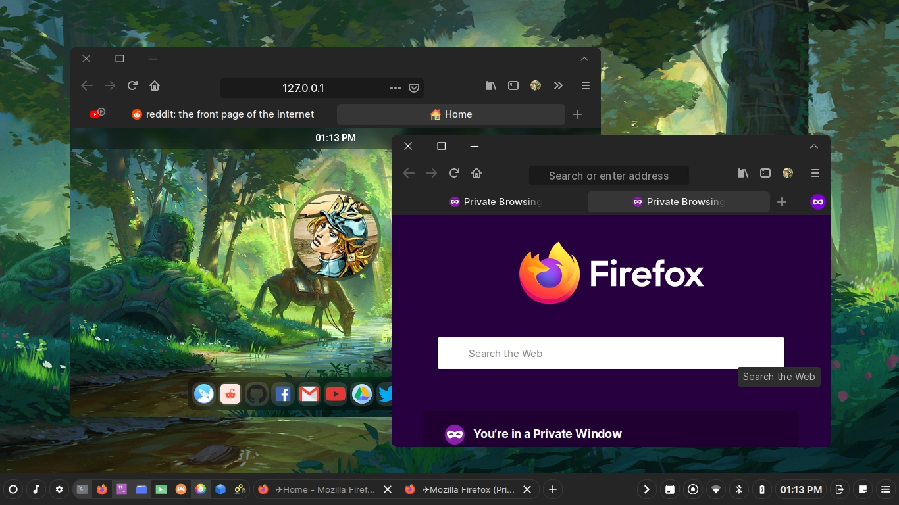
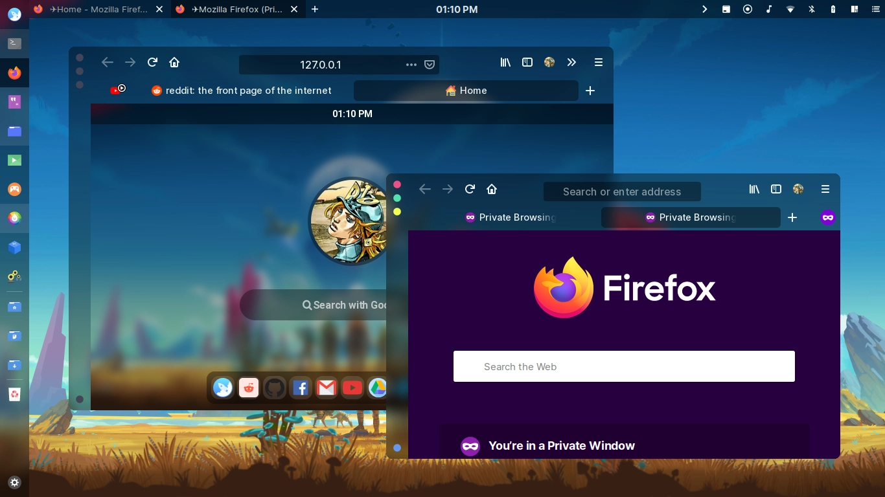
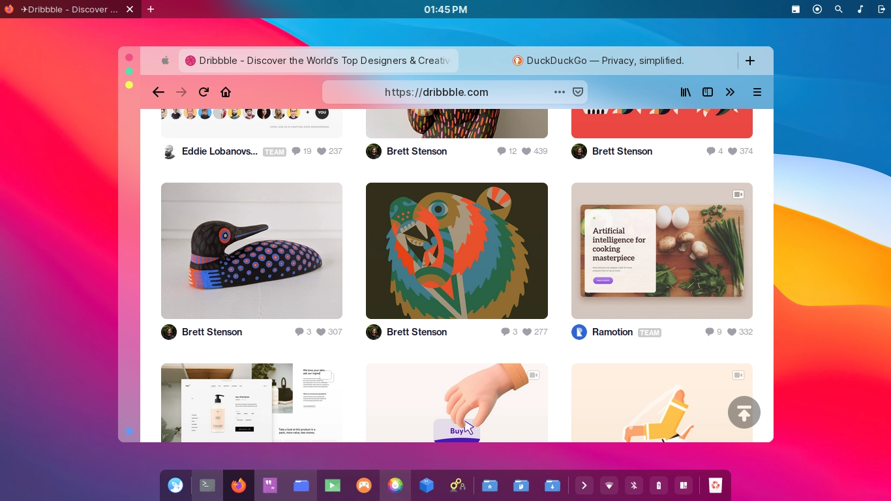

## blurredfox

### A modern Firefox CSS Theme

| Default Colorscheme (Uses System Colors) |
| --- |
|  |

| Dark Colorscheme |
| --- |
|  |

| Light Colorscheme |
| --- |
|  |

## Requirements

+ The latest Firefox
+ Compositor with blur shader (optional)
+ Linux machine - untested on macOS and Windows 10 - might work though (optional)

## How to

### Quick install for the linux lads

1. Run the script below, but make sure to replace the 'stable' with the Firefox Build you are using. If leave empty, it will still default to stable.

	+ stable - Firefox Stable Build
	+ dev - Firefox Developer Edition
	+ beta - Firefox Beta
	+ nightly - Firefox Nightly
	+ esr - Firefox Extended Support Release

	```
	# Examples:

	# Stable build's profile
  	$ curl -fsSL https://raw.githubusercontent.com/manilarome/blurredfox/script/install.sh | bash -s -- stable

  	# Nightly build's profile
  	$ curl -fsSL https://raw.githubusercontent.com/manilarome/blurredfox/script/install.sh | bash -s -- nightly
  	```

2. After the confirmation message that the theme is successfully installed, open firefox. Change the colorscheme by **`Open Menu > Customize > Change Colorscheme`**.

#### Installation notes:

+ If you have a multiple firefox builds, the script will still run without a problem. Just make sure to pass your target firefox build.
+ If you or your firefox build have a multiple profile, the script will return an error! Make sure you only have one!
+ It is advisible to check the script first before running it.
+ You need `bash` to run it.
+ If you have an existing chrome folder, the script will make a backup of it in your profile directory.
+ If the installation script is not working, feel free to submit an issue or a pull request.

### Manual Installation

1. Open `about:config` page.
2. A dialog will warn you, but ignore it, ~~just do it~~ press the `I accept the risk!` button.
3. Search for these:

	+ **`toolkit.legacyUserProfileCustomizations.stylesheets`**
	+ **`layers.acceleration.force-enabled`**
	+ **`gfx.webrender.all`**
	+ **`gfx.webrender.enabled`**
	+ **`layout.css.backdrop-filter.enabled`**
	+ **`svg.context-properties.content.enabled`**

	Then make sure to **enable them all!**

4. Go to your Firefox profile.
	+ Linux - `$HOME/.mozilla/firefox/XXXXXXX.default-XXXXXX/`.
	+ Windows 10 - `C:\Users\<USERNAME>\AppData\Roaming\Mozilla\Firefox\Profiles\XXXXXXX.default-XXXXXX`.
	+ macOS - `Users/<USERNAME>/Library/Application Support/Firefox/Profiles/XXXXXXX.default-XXXXXXX`.

5. Create a folder and name it **`chrome`**, then assuming that you already have cloned this repo, just copy the theme to `chrome` folder.
6. Restart Firefox.
7. Finally, you can now change whatever colorscheme you want in the Cusomization Window.

	+ Default - Uses system colors, but uses the theme's layout.
	+ Dark - Dark colorscheme. Good for the night.
	+ Light - Bright colorscheme. Good for killing the eyes.

### Unsintall

1. Go to your profile directory.
2. Delete the `chrome` folder.
3. If you used the installation script, you can also delete the `user.js` inside your profile directory.

## Note

### Some UI are broken!

1. Check if you're using the latest version of Firefox.
2. If you're not using Linux check the next note below.

### If you're using Windows or macOS and something's wrong

1. I only have Archlinux, so I cannot guarantee that it will work on Windows 10 and macOS without a problem. A feedback and a PR is absolutely welcome! All you can do or try is to install the theme, then change the value of `--bf-moz-appearance` variable to either `-moz-win-glass` if Windows 10 and `-moz-mac-vibrancy-dark` if macOS. Still, do not expect that it will work without a problem. The theme's untested on these platforms!

### Liar! Your theme's name is `blurredfox`, ***where is the blur***?!

1. Yeah, the name `blurredfox` is a lie, just like the cake. I named it blurredfox because it's designed to look gorgeous with a blur effect. You can, however, have the blur effect by:

	+ Making sure you have a compositor and it supports blur.
	+ If you're not using GNOME or KDE Plasma that has its own compositors, use tryone144's [feature/dual_kawase](https://github.com/tryone144/picom/tree/feature/dual_kawase) branch of picom. It includes the dual kawase shader.
	+ GNOME's compositor, mutter, doesn't support blur. Hey, GNOME devs, it's already 2020. Just kidding!
	+ If you're using KDE Plasma, read the next note below.

### I'm using KDE Plasma, but there's no blur! How many other lies have I been told by the council?

1. Enable the blur in your compositor. Go to `System Settings > Desktop Effects > Enable Blur`. Note that this will not enable the blur effect on all applications.
2. Enable the blur effect on all applications by installing a KWin script called [Force Blur](https://store.kde.org/p/1294604/). Make sure to read its manual. Don't you ever dare to create an issue about Force Blur! Just kidding! But yeah, I'm serious.
3. Go to `System Settings > KWin Scripts > Enable Force Blur`.
4. Change its settings. If there's no settings/settings icon, Logout. Re-login.

### Where is the scrollbar?

1. You can adjust the value of `scrollbar-width` in `userContent.css`.
2. Restart Firefox.

### I hate the colors! Why is everything transparent?!

1. You can change the colors in `userChrome.css`.
2. The transparency is only applied to `Dark` and `Light` colorschemes. `No transparency == No blur`.

### How can I set or change the colors for the Default colorscheme?

1. The default colorscheme are from Firefox and it uses the system colors. Although I only tried and tested it with `GTK3`, it should work with any platforms or environment as long as Firefox can detect your system colors. So all you can do is to switch theme to change its colorscheme.

## Got a problem?

If you have already read the README, free to open an issue [here](https://github.com/manilarome/blurredfox/issues)!

## Got a patch?

You're absolutely welcome to submit a pull request [here](https://github.com/manilarome/blurredfox/pulls)!

## TODO

PR's are welcome!

- [ ] Render site content under the navbar like macOS
- [ ] Fix UI inconsistencies
- [ ] Better CSS
